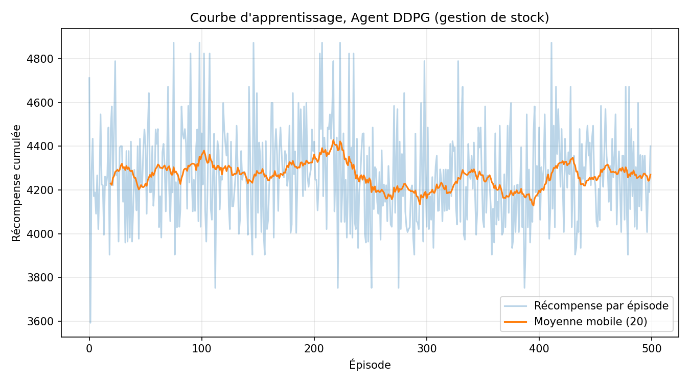
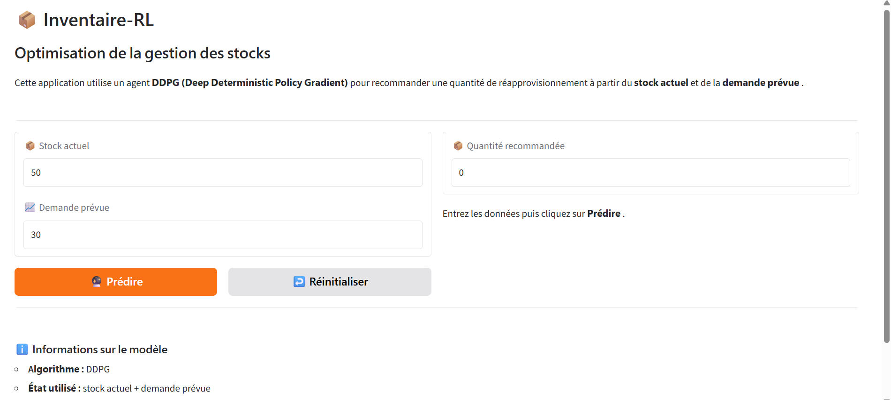
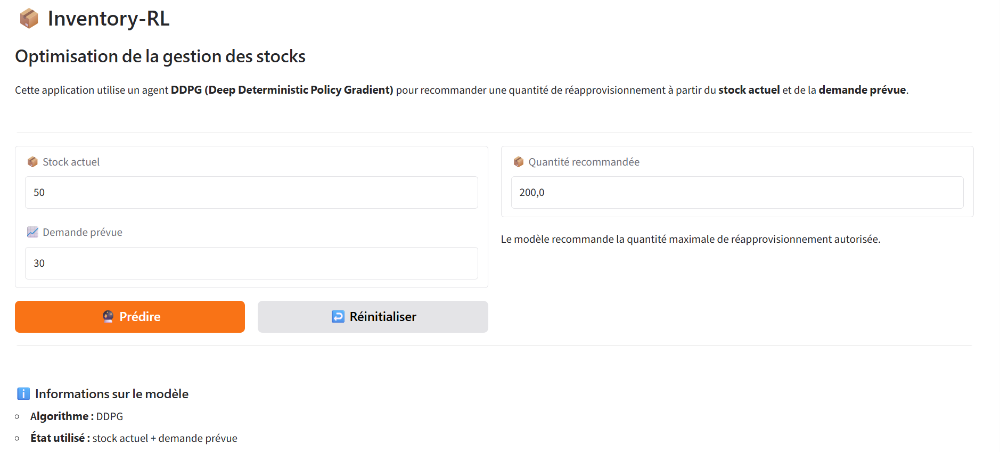

#  Inventory-RL

## Optimisation de la gestion des stocks par Reinforcement Learning

**Inventory-RL** est un projet d'optimisation de la gestion des stocks utilisant l'**apprentissage par renforcement (Reinforcement Learning)**.

L'objectif est de développer un agent intelligent capable de déterminer une **quantité optimale de réapprovisionnement** en fonction du **niveau de stock actuel** et de la **demande prévue**, afin d'améliorer la gestion des stocks et de réduire les coûts associés.

Le projet utilise l'algorithme **DDPG (Deep Deterministic Policy Gradient)**, adapté aux problèmes dans lesquels les actions sont continues.

---

##  Objectif du projet

La gestion des stocks consiste à déterminer les quantités à commander afin de répondre à la demande tout en limitant les coûts liés au stockage, aux commandes et aux ruptures de stock.

Dans ce projet, la gestion des stocks est formulée comme un **problème d'apprentissage par renforcement**.

L'agent apprend progressivement à prendre des décisions de réapprovisionnement à partir de l'état du stock et de la prévision de la demande.

L'objectif est de trouver une politique de commande permettant de maximiser la récompense cumulée tout en recherchant un compromis entre :

*  la disponibilité des produits ;
*  la satisfaction de la demande ;
*  les coûts de stockage ;
*  les coûts liés aux ruptures de stock ;
*  les coûts de commande.

L'algorithme utilisé est :

> **DDPG — Deep Deterministic Policy Gradient**

Il permet à l'agent de sélectionner une quantité de commande dans un **espace d'actions continues**.

---

#  Données utilisées

Le projet utilise un jeu de données de gestion des stocks situé dans le répertoire :

```text
data/
└── retail_store_inventory.csv
```

Le fichier contient notamment des informations relatives aux magasins, aux produits, aux niveaux de stock, aux ventes, aux prix et aux prévisions de demande.

### Principales variables

| Variable          | Description                |
| ----------------- | -------------------------- |
| `Store ID`        | Identifiant du magasin     |
| `Product ID`      | Identifiant du produit     |
| `Date`            | Date de l'observation      |
| `Inventory Level` | Niveau de stock disponible |
| `Demand Forecast` | Prévision de la demande    |
| `Units Sold`      | Quantité vendue            |
| `Price`           | Prix du produit            |

Ces données permettent de simuler les décisions de réapprovisionnement et d'étudier leurs conséquences sur le stock, les ventes et les coûts.

---

#  Formulation du problème en Reinforcement Learning

Le problème est modélisé sous la forme d'un **Processus de Décision de Markov (MDP)**.

L'agent interagit avec un environnement de gestion des stocks.

À chaque étape :

```text
État
  ↓
Agent DDPG
  ↓
Action : quantité à commander
  ↓
Environnement
  ↓
Nouvel état + récompense
```

---

##  Environnement

L'environnement est défini dans :

```text
env/inventory_env.py
```

Il représente le système de gestion des stocks dans lequel l'agent prend ses décisions.

---

##  État

À chaque étape, l'agent observe deux informations principales :

```text
[stock actuel, demande prévue]
```

L'état utilisé par le modèle est donc de dimension **2**.

Les variables sont normalisées avant d'être transmises au réseau de neurones.

---

##  Action

L'action correspond à la quantité de produits que l'agent décide de commander.

L'espace d'action est continu :

```text
0 ≤ quantité commandée ≤ 200
```

La quantité maximale autorisée est donc de **200 unités**.

Cette caractéristique justifie l'utilisation de l'algorithme **DDPG**.

---

##  Récompense

Après chaque décision de commande, l'environnement simule l'évolution du stock et calcule une récompense.

La récompense prend notamment en compte :

* le revenu généré par les ventes ;
* le coût de stockage ;
* le coût lié aux ruptures de stock.

Le principe général est :

```text
Récompense = Revenu - Coût de stockage - Coût de rupture
```

L'agent cherche donc à apprendre des décisions permettant d'obtenir une récompense cumulée élevée.

---

##  Épisode

Un épisode correspond à une période de simulation de gestion des stocks pouvant aller jusqu'à **365 jours**.

À chaque jour, l'agent :

1. observe l'état du stock ;
2. observe la demande prévue ;
3. choisit une quantité à commander ;
4. fait face à la demande ;
5. reçoit une récompense ;
6. passe à l'état suivant.

Le processus est répété jusqu'à la fin de l'épisode.

---

#  Agent DDPG

L'implémentation de l'agent est située dans :

```text
agent/ddpg.py
```

L'agent DDPG comprend notamment :

* un réseau **Actor** ;
* un réseau **Critic** ;
* un Actor cible ;
* un Critic cible ;
* une mémoire de rejeu (**Replay Buffer**) ;
* un bruit d'exploration **Ornstein-Uhlenbeck**.

### Architecture simplifiée

```text
              ┌─────────────────────┐
              │        État          │
              │ Stock + Demande      │
              └──────────┬──────────┘
                         │
                         ▼
                ┌────────────────┐
                │     ACTOR      │
                │ Neural Network │
                └───────┬────────┘
                        │
                        ▼
                Quantité à commander
                   0 ≤ action ≤ 200
                        │
                        ▼
                ┌────────────────┐
                │  Environnement │
                └───────┬────────┘
                        │
                 Reward + État suivant
                        │
                        ▼
                 ┌──────────────┐
                 │    CRITIC    │
                 │    Q-value   │
                 └──────────────┘
```

---

#  Entraînement

L'entraînement est réalisé avec :

```text
train.py
```

Pour lancer un entraînement avec les paramètres par défaut :

```bash
python train.py
```

### Principaux paramètres

| Paramètre        | Description                         |
| ---------------- | ----------------------------------- |
| `--episodes`     | Nombre d'épisodes d'entraînement    |
| `--batch_size`   | Taille du batch                     |
| `--warmup_steps` | Nombre de pas avant l'apprentissage |
| `--seed`         | Graine aléatoire                    |
| `--store_id`     | Identifiant du magasin              |
| `--product_id`   | Identifiant du produit              |
| `--save_dir`     | Répertoire de sauvegarde            |
| `--device`       | `cpu`, `cuda` ou `auto`             |

Exemple :

```bash
python train.py --episodes 500 --batch_size 128 --warmup_steps 1000 --seed 42
```

Les modèles entraînés sont sauvegardés dans :

```text
results/models/
```

Les principaux fichiers sont notamment :

```text
results/models/
├── ddpg_final_actor.pth
├── ddpg_final_critic.pth
└── ddpg_final_config.pth
```

---

# 📈 Résultats de l'entraînement

Une courbe d'entraînement permet de visualiser l'évolution de la récompense au cours des épisodes.

### Courbe d'entraînement



Cette courbe permet notamment d'observer l'évolution de la performance de l'agent au cours de l'apprentissage.

---

#  Évaluation

L'évaluation est réalisée à l'aide de :

```text
evaluate.py
```

Le module permet de calculer différentes métriques et de comparer la politique apprise avec des politiques de référence.

---

##  Métriques utilisées

Les principales métriques sont :

* coût total moyen par épisode ;
* écart-type du coût ;
* coût moyen de stockage ;
* coût moyen des commandes ;
* pénalité moyenne liée aux ruptures ;
* récompense moyenne ;
* longueur moyenne des épisodes.

---

# 🔄 Politiques de référence

Trois politiques de référence sont prévues.

### 1. Greedy Policy

La politique gloutonne commande une quantité fixe lorsque le stock devient inférieur à un seuil.

```text
Si stock < seuil :
    commander
Sinon :
    ne rien commander
```

### 2. Forecast Matching

Cette politique utilise la prévision de la demande pour déterminer la quantité à commander, avec un stock de sécurité.

### 3. Random Policy

La politique aléatoire sélectionne une quantité de commande aléatoire dans l'intervalle autorisé :

```text
0 ≤ action ≤ 200
```

Ces politiques permettent de disposer de points de comparaison avec la politique apprise par DDPG.

---

# 📊 Visualisations de l'évaluation

Le module `evaluate.py` permet notamment de produire :

* la trajectoire de l'inventaire ;
* l'évolution de la demande ;
* les quantités commandées ;
* l'évolution des récompenses ;
* les coûts de stockage ;
* les coûts de commande ;
* les pénalités de rupture ;
* la comparaison DDPG / baseline.

Les résultats graphiques sont regroupés dans :

```text
results/plots/
```

---

# 🖥️ Interface utilisateur avec Gradio

Une interface utilisateur a également été développée avec **Gradio**.

Elle permet à un utilisateur de saisir :

* le **stock actuel** ;
* la **demande prévue**.

L'application utilise ensuite le modèle DDPG entraîné pour recommander une quantité de réapprovisionnement.

Le fichier de l'application est :

```text
app.py
```

### Lancement de l'application

Depuis la racine du projet :

```bash
python app.py
```

L'application est alors accessible localement à l'adresse :

```text
http://127.0.0.1:7860
```

---

##  Capture de l'interface Gradio



L'interface permet de renseigner le stock actuel et la demande prévue avant de lancer la prédiction.

---

##  Exemple de prédiction



Après avoir renseigné les données et cliqué sur **Prédire**, l'application affiche la quantité de réapprovisionnement recommandée par le modèle DDPG.

La quantité recommandée est limitée à :

```text
0 ≤ quantité ≤ 200 unités
```

---

# 📁 Structure du projet

```text
inventory-rl/
│
├── agent/
│   └── ddpg.py
│
├── data/
│   └── retail_store_inventory.csv
│
├── env/
│   └── inventory_env.py
│
├── notebooks/
│   ├── 01_exploration.ipynb
│   ├── 02_agent.ipynb
│   └── 03_evaluation.ipynb
│
├── results/
│   ├── models/
│   │   ├── ddpg_final_actor.pth
│   │   ├── ddpg_final_critic.pth
│   │   └── ddpg_final_config.pth
│   │
│   └── plots/
│       ├── training_curve.png
│       └── gradio/
│           ├── gradio_interface.png
│           └── gradio_prediction.png
│
├── app.py
├── evaluate.py
├── train.py
├── utils.py
├── requirements.txt
└── README.md
```

---

#  Description des principaux fichiers

| Fichier                           | Rôle                                     |
| --------------------------------- | ---------------------------------------- |
| `agent/ddpg.py`                   | Implémentation de l'agent DDPG           |
| `env/inventory_env.py`            | Environnement de gestion des stocks      |
| `train.py`                        | Entraînement de l'agent                  |
| `evaluate.py`                     | Évaluation et comparaison des politiques |
| `app.py`                          | Interface utilisateur Gradio             |
| `utils.py`                        | Fonctions utilitaires                    |
| `data/retail_store_inventory.csv` | Jeu de données                           |
| `01_exploration.ipynb`            | Exploration des données                  |
| `02_agent.ipynb`                  | Expérimentation et entraînement          |
| `03_evaluation.ipynb`             | Évaluation du modèle                     |
| `requirements.txt`                | Dépendances Python                       |
| `README.md`                       | Documentation du projet                  |

---

#  Installation

## 1. Cloner le projet

```bash
git clone https://github.com/Djifa02/inventory-rl.git
cd inventory-rl
```

## 2. Créer un environnement virtuel

```bash
python -m venv .venv
```

Sous Windows :

```powershell
.venv\Scripts\activate
```

## 3. Installer les dépendances

```bash
pip install -r requirements.txt
```

---

# ▶️ Utilisation rapide

### Entraîner le modèle

```bash
python train.py
```

### Évaluer le modèle

```bash
python evaluate.py
```

### Lancer l'application

```bash
python app.py
```

Puis ouvrir :

```text
http://127.0.0.1:7860
```

---

#  Technologies utilisées

Le projet utilise principalement :

* **Python**
* **PyTorch**
* **NumPy**
* **Pandas**
* **Matplotlib**
* **Seaborn**
* **Gradio**
* **Jupyter Notebook**
* **Git / GitHub**

---

# 🔬 Résumé du fonctionnement

Le fonctionnement global du projet peut être résumé ainsi :

```text
                 DONNÉES
                    │
                    ▼
        retail_store_inventory.csv
                    │
                    ▼
          Exploration des données
                    │
                    ▼
          Environnement RL
          inventory_env.py
                    │
                    ▼
             Agent DDPG
              ddpg.py
                    │
                    ▼
             Entraînement
               train.py
                    │
                    ▼
          Modèle DDPG entraîné
                    │
             ┌──────┴──────┐
             │             │
             ▼             ▼
        Évaluation      Gradio
       evaluate.py       app.py
             │             │
             ▼             ▼
       Métriques       Prédiction
       et graphiques   de commande
```

---

#  Conclusion

Le projet **Inventory-RL** propose une approche basée sur le Reinforcement Learning pour l'optimisation des décisions de réapprovisionnement.

L'agent **DDPG** apprend à déterminer une quantité de commande à partir de deux informations principales :

```text
Stock actuel
     +
Demande prévue
     ↓
Agent DDPG
     ↓
Quantité recommandée
```

Le projet comprend ainsi :

* une exploration des données ;
* un environnement de gestion des stocks ;
* un agent DDPG ;
* une phase d'entraînement ;
* une phase d'évaluation ;
* des politiques de référence ;
* des visualisations des résultats ;
* une interface interactive **Gradio** permettant d'utiliser le modèle entraîné.

L'objectif final est de montrer comment l'apprentissage par renforcement peut être utilisé pour aider à prendre des décisions de réapprovisionnement dans un contexte de gestion des stocks.
